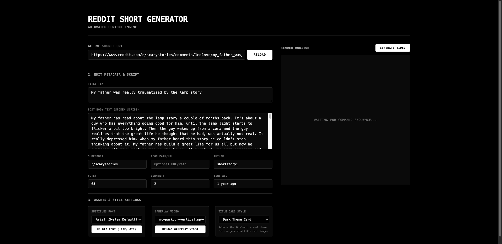
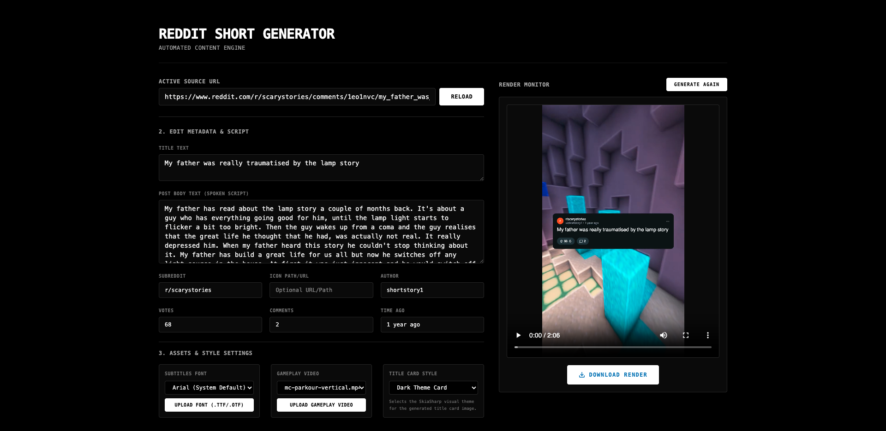
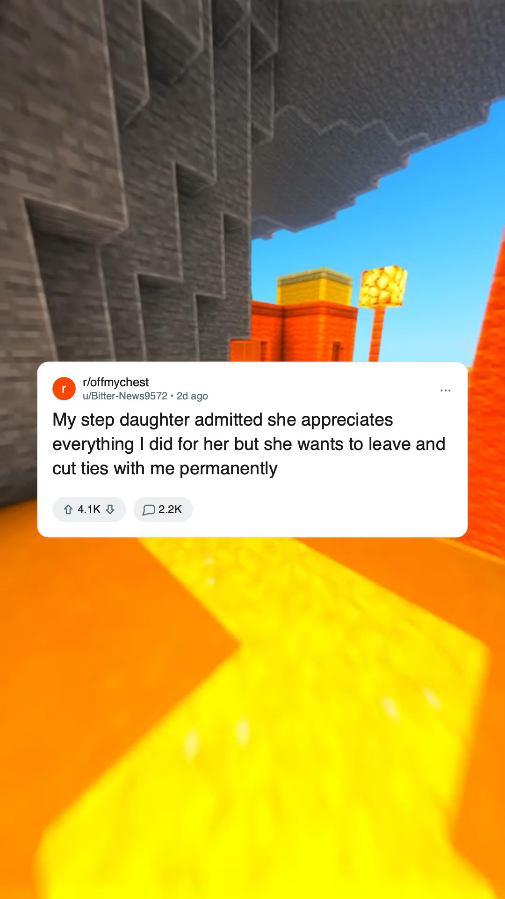

# Reddit Short Generator

Automated content engine that turns any Reddit post into a short-form video — title card, TTS voiceover, word-by-word subtitles, gameplay background — ready to publish on TikTok, YouTube Shorts, or Instagram Reels.

Built for creators, content farms, and automation engineers who need to scale Reddit-story content without manual editing. Paste a URL, hit generate, get a video. No API keys, no subscriptions, no cloud dependencies — everything runs locally.

- Fully automated Reddit-to-video pipeline — replaces a manual 20-minute editing workflow with a single-click 60-second generation
- Designed for scale: hundreds of unique short-form videos per day from organic Reddit content, no API keys or subscriptions required
- End-to-end ownership: scraping, rendering, audio synthesis, subtitle generation, and video composition — all in-house

## Screenshots

| Loaded post | Generated video | Sample output |
|---|---|---|
|  |  |  |

## How automation works

The whole thing is a stateless pipeline strung together in `Home.razor.cs`:

```
URL input → fetch & parse → title card (SkiaSharp) → TTS (Edge TTS) → subtitles (ASS) → compose (ffmpeg) → video
```

Each stage is a separate service wired via DI, so swapping any piece (e.g. TTS provider, video backend) is a one-liner.

### Services

| Service | What it does |
|---|---|
| `RedditService` | Curls `old.reddit.com`, parses HTML with HtmlAgilityPack, extracts post metadata |
| `RedditCardService` | Generates a 1080×1920 title card via SkiaSharp — subreddit icon, title wrapping, vote/comment pills, emoji support |
| `EdgeTtsService` | Reverses the Edge browser TTS WebSocket protocol: word-boundary timestamps + MP3 audio |
| `SubtitleGeneratorService` | Converts word boundaries into ASS subtitle files (word-by-word karaoke style) |
| `FfmpegService` | Probes durations with ffprobe, builds complex ffmpeg filter graphs, runs compositing |

### Dependency injection

All services are registered as singletons in `Program.cs`:

```csharp
builder.Services.AddSingleton<RedditService>();
builder.Services.AddSingleton<RedditCardService>();
builder.Services.AddSingleton<EdgeTtsService>();
builder.Services.AddSingleton<SubtitleGeneratorService>();
builder.Services.AddSingleton<FfmpegService>();
```

The page (`Home.razor.cs`) gets them injected via `[Inject]` properties. No manual wiring — Blazor handles the lifecycle.

### API integrations

- **ffmpeg** — launched as a subprocess with complex filter graphs: concat video loops, overlay title card, burn in ASS subtitles, mix title + body audio tracks
- **Edge TTS** — reverse-engineered WebSocket protocol to Microsoft's speech synthesis endpoint (same one powering Edge browser read-aloud). Handles auth tokens, SSML, word-boundary metadata
- **SkiaSharp** — renders the Reddit-style title card entirely in code: rounded rects, custom path-drawn vote arrows, comment icon, emoji-aware text wrapping
- **HtmlAgilityPack** — parses the scraped old.reddit.com DOM for post title, body, author, votes, comments, timestamps

## Build & run

```bash
# Prerequisites
#   - .NET 10 SDK
#   - ffmpeg in PATH

dotnet run --urls http://localhost:5000
```

Open `http://localhost:5000`, paste a Reddit post URL, hit **Fetch Content**, tweak metadata, select a gameplay video, then **Generate Video**.

